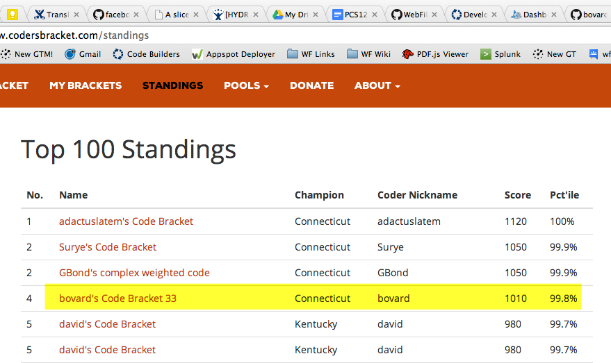

# Coder's Bracket 2014

This is my entry to the coder's bracket competition 2014 [https://www.codersbracket.com/](https://www.codersbracket.com/).

### Description
Basically it's a bracketoligist approach. I took some very basic stats on how often 1st place has beat 16th place etc... and extrapolated them for all positions.

#### Example
For example if I saw a match up against a 1 vs 15 I would know that the chances of 1 prevailing would be very similar to 1 vs 16 (100%) and 2 vs 15 (96%). So then I would say the chances of 1 beating 15 is:
```
var chance = (1 + .96)/2;
if (Math.random() < chace) {
  team1.win();
} else {
  team2.win();
}
```

So I end up approximating the odds, then rolling a dice and hoping I get lucky!

### Results

The results are in! I made 64 brackets, and 6 of them appeared in the top 100!

You can check out [full standings](https://www.codersbracket.com/standings) but my entries came in:

| Finish | Bracket # | Score | Percentile |
| ---    | ---       | ---   | ---        |
| 4th    | 33        | 1010  | 99.8%      |
| 50th   | 45        | 730   | 95.1%      |
| 56th   | 20        | 710   | 94.5%      |
| 56th   | 26        | 710   | 94.5%      |
| 56th   | 27        | 710   | 94.5%      |
| 71st   | 9         | 690   | 93.1%      |

And here is visual proof for when they update their site for next year:



Based on a bit of simple math (100th place was in the 91.6th percentile), there were about 1000 bracket submitted. So if my algorithm was completely random we'd expect 6 in the top 100. 
